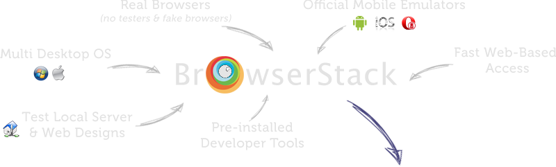
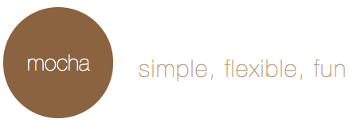

# JavaScript Testing

---

## Our Presenters

## David Luecke

* GitHub: [daffl.github.com](http://daffl.github.com), Twitter: [@daffl](http://twitter.com/daffl)

## Eric Kryski

* GitHub: [ekryski.github.com](http://ekryski.github.com), Twitter: [@ekryski](http://twitter.com/ekryski)

[yycjs.github.io/javascript-testing](http://yycjs.github.io/javascript-testing)

---

## Our Sponsors

## Assembly Co-working Space

## PetroFeed

---

## Our Sponsors

## Village Brewery

---

## Last Month - MVWFT?

* [TodoMVC](http://todomvc.com/)
* [Backbone JS](http://backbonejs.org/)
* [CanJS](http://canjs.com/)
    * Live binding
    * Models
* [Real time TodoMVC](https://github.com/yycjs/todomvc/tree/canjs-realtime)
    * CanJS
    * NodeJS
    * SocketIO

---

## Testing!

- __Acceptance__ - High level requirements and specifications.
- __Functional__ - Based on the specification/requirements of the software component. High level test of a feature or user interaction.
- __Unit__ - Tests individual, contained units of code.
- __Integration__ - Test interfaces and interaction of various components (both inside and outside the system).
- __Regression__ - Used to make sure that your software does get worse instead of getting better.
- __Performance__ - Test the speed and performance limits of the system. Find optimal operation limits.

---

## JavaScript testing

JavaScript testing very *"young"*.

Client side testing still not a common practise.

### Different environments

- Client
	- Requires both, functional and unit testing
	- Browsers
	- Screen resolutions (mobile)
	- Internet Explorer (Boo!)
- Server (NodeJS)

---

## [BrowserStack](http://browserstack.com)

### Live web-based cross browser testing

- Browsers on VMs in Mac OS and Windows, mobile emulators
- RESTful API
- Local tunneling
- Screenshots

---

## Headless Browsers

### [PhantomJS](http://phantomjs.org/)

- Webkit based.
- Written in C++. API in Javascript and Coffeescript.

### [Zombie.js](http://zombie.labnotes.org/)

- Written in Coffeescript and NodeJS.
- Use jQuery on server side.

__Pro__: Fast, works well for automated acceptance and UI tests

__Con__: Doesn't test actual browsers

---

# Unit Testing

---

## What?

- Split functionality into contained units. Ideally each function should perform one __unit__ of work.
- Ideally we also want to isolate the code to be tested (using mocks, stubs, test harnesses)
- Test each part.
	- Boundary Value Testing
	- White Box Testing

You don't need to write tests for every scenario (and you should't). Try and kill many birds with one stone.

---

## JavaScript unit testing

---

## A blog post

	!javascript
	var BlogPost = function(title, content, date) {
		this.title = title;
		this.content = content.replace(/n/g, " ");
		this.date = date || new Date();
		this.published = false;
	}

	BlogPost.prototype.publish = function() {
		this.published = true;
	}

	BlogPost.prototype.toString = function() {
		if(!this.published) {
			throw "This blog post is not published";
		}
		return "<h1>" + this.title + "</h1>" +
			"<h6>Published on " + this.date.toString() + "</h6>" +
			"
" + this.content + "
";
	}
---

# Running tests

---

## Test runners

Automate running your JavaScript tests __in any available browser__ and make the results persistent.

- [Karma](http://karma-runner.github.io/0.8/index.html)
- [Testem](https://github.com/airportyh/testem)
- [Testee.js](http://daffl.github.io/testee.js/)
- [YUI Yeti](http://yuilibrary.com/projects/yeti/)
- [BusterJS](http://docs.busterjs.org/en/latest/)

Services

- [Testling CI](https://ci.testling.com/)
- [TestSwarm](http://swarm.jquery.org/)

---

## Testee

Testee.JS runs your Mocha, QUnit or Jasmine unit tests from the command line using any browser.

- Runs on all browsers (supporting SocketIO)
- Many output formats

- CI integration
- BrowserStack support
- GruntJS Task

---

## Continuous Integration

- Use source control management system (SCM) for builds
- Run reports, tests, deploy or other tools on each SCM change
- Popular open source CI servers:
	- [Jenkins](http://jenkins-ci.org/): Probably most popular CI server, formerly Hudson
	- [CruiseControl](http://cruisecontrol.sourceforge.net/): CI framework initially by Thoughtworks
	- [TravisCI](http://travis-ci.org): Distributed build platform for the open source community

---

# Functional testing

---

## Function web application testing

### Open Source Libraries

- [Zombie.js](http://zombie.labnotes.org/) - Headles browser with automation API
- [CasperJS](http://casperjs.org/) - Website automation using PhantomJS
- [FuncUnit](http://funcunit.com) - Clients side functional testing
- [Selenium](http://docs.seleniumhq.org/) - Browser automation toool

### Services

- [SauceLabs](https://saucelabs.com/)
- [uTest](http://utest.com)

---

## __FuncUnit__

Functional testing library built on top of __jQuery__ and __QUnit__:

- Use jQuery syntax to emulate user input
- Write QUnit style tests

__Testing a [TodoMVC](http://todomvc.com) app__

	!javascript
	test('TodoMVC app', function() {
		S('#new-todo').click().type('Do some nerdy stuff\r').wait(500);
		S('#todo-list li').size(1, 'Got one Todo');
		S('#todo-list li:first label')
			.html('Do some nerdy stuff', 'Todo has correct text');
		S('#todo-count').html(/<strong>1<\/strong>(.*)item(.*)left/,
			'Todo count text is correct');
	});

---

## Next month

- 3 hour slide show about Daves holiday
- TBA
